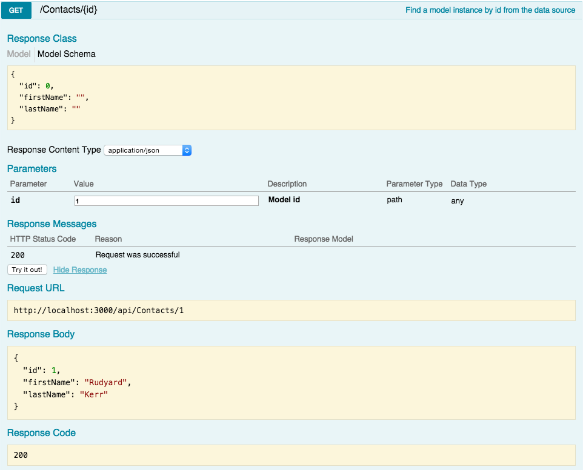

In this tutorial, we’ll talk about getting started with LoopBack and SQL Server. We’ll create an API using an existing SQL Server table as the backend. Let’s jump right in.

## Prerequisites

- You have Node.js installed

- You have some version of SQL Server installed

## SQL Server

You know SQL Server.

> _SQL Server is Microsofts RDMS offering for OLTP, data warehousing, business intelligence and analytics._

### The data

We’re going to be using an existing SQL Server table in our database. This should be a very common scenario when working with LoopBack and SQL Server as you are likely not creating your tables in SQL Server specifically while creating your LoopBack application.

We’ll use the excellent [generatedata.com](http://www.generatedata.com/) site to seed our table with 100 rows.

```sql
CREATE TABLE [contacts] (
    [id] INTEGER NOT NULL IDENTITY(1, 1),
    [first_name] VARCHAR(255) NULL,
    [last_name] VARCHAR(255) NULL,
    PRIMARY KEY ([id])
);
GO

INSERT INTO contacts([first_name],[last_name]) VALUES('Rudyard','Kerr'),('Stone','Cardenas'),('Jelani','Adkins'),('Solomon','Whitley'),('Ronan','Gillespie'),('Arsenio','Gutierrez'),('Moses','Kent'),('Jonah','Hammond'),('Ezekiel','Watson'),('Hayden','Mccray');
INSERT INTO contacts([first_name],[last_name]) VALUES('Wesley','Campbell'),('Gabriel','Williams'),('Norman','Rosales'),('Chester','Wade'),('James','Noble'),('Alan','Graves'),('Aidan','Cameron'),('Hu','Luna'),('Philip','Harrison'),('Hu','Wilkerson');
INSERT INTO contacts([first_name],[last_name]) VALUES('Uriel','Acosta'),('Troy','May'),('Cody','Sweet'),('Derek','Maxwell'),('Ryan','Russell'),('Lance','Jenkins'),('Kyle','May'),('Jerome','Mcdowell'),('Jermaine','Gray'),('Austin','Graham');
INSERT INTO contacts([first_name],[last_name]) VALUES('Kareem','Flynn'),('Griffin','Smith'),('Lucas','Ruiz'),('Vernon','Rivers'),('Allen','Pearson'),('Murphy','Glass'),('Robert','Ryan'),('Gray','Burke'),('Joseph','Stephenson'),('Josiah','Vinson');
INSERT INTO contacts([first_name],[last_name]) VALUES('Malachi','Burch'),('Stone','Horne'),('Harding','Santana'),('Blake','Valentine'),('Grady','Pollard'),('Lance','Johnson'),('Myles','Vance'),('Amery','Ferguson'),('Garth','Padilla'),('Fuller','Wolf');
INSERT INTO contacts([first_name],[last_name]) VALUES('Lyle','Martin'),('Isaac','Huff'),('Steven','Lawrence'),('Sylvester','Gallagher'),('Benjamin','West'),('Allistair','Norman'),('Armando','Hawkins'),('Allen','Rivas'),('Norman','Fischer'),('Gray','Silva');
INSERT INTO contacts([first_name],[last_name]) VALUES('Theodore','Mcdonald'),('Luke','Hicks'),('Reed','Baxter'),('August','Gould'),('Carter','Durham'),('Uriah','Parker'),('Alan','Griffin'),('Forrest','Dunn'),('Dalton','Horne'),('Ryan','Hood');
INSERT INTO contacts([first_name],[last_name]) VALUES('Mason','Paul'),('Xander','Nunez'),('Nasim','Reyes'),('Abbot','Buckner'),('Wayne','Beach'),('Rigel','Keith'),('Brennan','Dunn'),('Perry','Burns'),('Lars','Merritt'),('Burke','Boyle');
INSERT INTO contacts([first_name],[last_name]) VALUES('Fuller','Vaughan'),('Davis','White'),('Nehru','Foster'),('Gareth','Santos'),('Odysseus','Oconnor'),('Camden','Myers'),('Jacob','Dorsey'),('Laith','Mooney'),('Bert','Wiggins'),('Lyle','Bradshaw');
INSERT INTO contacts([first_name],[last_name]) VALUES('Cedric','House'),('Honorato','Rosario'),('Perry','Rasmussen'),('Charles','Dotson'),('Burton','Rivas'),('Cruz','Wheeler'),('Forrest','Cote'),('Fuller','Hooper'),('Raja','Holden'),('Raja','Leonard');
```

Alright, now that we have our already existing table example setup, let’s move on to LoopBack.

## LoopBack

> _LoopBack is a highly-extensible, open-source Node.js framework_

[LoopBack](http://loopback.io/) allows you to do many things like:

- Quickly create dynamic end-to-end REST APIs.

- Connect devices and browsers to data and services.

- Use Android, iOS, and AngularJS SDKs to easily create client apps.

- Add-on components for push, file management, 3rd-party login, and geolocation.

- Use StrongLoop Arc to visually edit, deploy, and monitor LoopBack apps.

- LoopBack API gateway acts an intermediary between API consumers (clients) and API providers to externalize, secure, and manage APIs.

- Runs on-premises or in the cloud

We are going to use LoopBack to:

- Connect to our SQL Server database.

- Discover the schema of our already existing table and create a LoopBack model based upon the schema.

- Create a REST based API using this model.

### Install LoopBack

Before we do any of that, let’s walk through the very simple steps needed to install LoopBack.

```bash
npm install -g strongloop
```

Well that was easy! Now let’s scaffold our new LoopBack API application.

Run the LoopBack application generator and answer a few quick questions.

```bash
$ slc loopback
     _-----_
    |       |    .--------------------------.
    |--(o)--|    |  Let's create a LoopBack |
   `---------´   |       application!       |
    ( _´U`_ )    '--------------------------'
    /___A___\
     |  ~  |
   __'.___.'__
 ´   `  |° ´ Y `
? What's the name of your application? loopback-sqlserver-example
? Enter name of the directory to contain the project: loopback-sqlserver-example
```

After the generator runs and npm installs all the necessary packages, you’ll receive a message like this.

```bash
Next steps:

  Change directory to your app
    $ cd loopback-sqlserver-example

  Create a model in your app
    $ slc loopback:model

  Optional: Enable StrongOps monitoring
    $ slc strongops

  Run the app
    $ slc run .
```

The only thing left for us right now is to install a database connector for our application so that we can connect to SQL Server. Loopback offers a number of different connects, but we want loopback-connector-mssql.

```bash
npm install loopback-connector-mssql --save
```

### Connect to SQL Server

Now we need to point our LoopBack application to our SQL Server. In your loopback-sqlserver-example directory, open up the server/datasources.js file. Initially there is only a listing for the in-memory database, but we want to add a reference to our SQL Server.

Edit the file to look like this, of course, replacing with your SQL Server host, username and password.

```json
{
  "db": {
    "name": "db",
    "connector": "memory"
  },
  "mySqlServer": {
    "host": "192.168.0.23",
    "port": 1433,
    "database": "myDb",
    "username": "username",
    "password": "password",
    "name": "mySqlServer",
    "connector": "mssql",
    "schema": "dbo"
  }
}
```

Now we’re ready to build our LoopBack model for our SQL Server table.

### LoopBack table model

LoopBack uses JSON models to [define](http://docs.strongloop.com/display/public/LB/SQL+Server+connector#SQLServerconnector-Definingmodels) tables in the application. While we could create the JSON by hand, we want to use our already existing table to automatically generate it for us. Thankfully LoopBack offers the discoverSchema method which will auto generate the JSON for us based upon our already existent SQL Server table.

Create a server/discover.js file and put in this code.

```javascript
var app = require("./server");
var dataSource = app.dataSources.mySqlServer;

dataSource.discoverSchema(
  "contacts",
  {
    owner: "dbo",
  },
  function (err, schema) {
    console.log(JSON.stringify(schema, null, "  "));
  }
);
```

First we get a reference to our app and then to the mySqlServer data source we created in the datasource.js file. Then we tell LoopBack to go get the schema of our table and output the JSON model to the console.

Run this script and you’ll get LoopBack’s JSON model representation of your table.

```json
$ node server/discover.js
{
  "name": "Contacts",
  "options": {
    "idInjection": false,
    "mssql": {
      "schema": "dbo",
      "table": "contacts"
    }
  },
  "properties": {
    "id": {
      "type": "Number",
      "required": true,
      "length": null,
      "precision": 10,
      "scale": 0,
      "id": 1,
      "mssql": {
        "columnName": "id",
        "dataType": "int",
        "dataLength": null,
        "dataPrecision": 10,
        "dataScale": 0,
        "nullable": "NO"
      }
    },
    "firstName": {
      "type": "String",
      "required": false,
      "length": 255,
      "precision": null,
      "scale": null,
      "mssql": {
        "columnName": "first_name",
        "dataType": "varchar",
        "dataLength": 255,
        "dataPrecision": null,
        "dataScale": null,
        "nullable": "YES"
      }
    },
    "lastName": {
      "type": "String",
      "required": false,
      "length": 255,
      "precision": null,
      "scale": null,
      "mssql": {
        "columnName": "last_name",
        "dataType": "varchar",
        "dataLength": 255,
        "dataPrecision": null,
        "dataScale": null,
        "nullable": "YES"
      }
    }
  }
}
```

Cool! LoopBack just autogenerated a model of our contacts table based upon the already existing table.

Let’s get that model integrated into our app. We need to create two files to represent our contacts table in LoopBack.

```bash
$ mkdir -p common/models
$ touch common/models/contacts.js
$ touch common/models/contacts.json
```

The JSON file will hold our model definition and JavaScript file will export our model. There are more uses for the JavaScript file which we’ll get into in future posts.

First, copy the JSON we generated above into the contacts.json file.

Next, drop this simple code into the contacts.js file.

```javascript
module.exports = function (Contact) {};
```

That’s it for creating our LoopBack model. Now we can tell LoopBack to use our model in the API.

### Create the API

We need to tell LoopBack to use our newly created Contact model in the API. To do so, we open up server/model-config.json and add an entry for our model.

```json
{
  "_meta": {
    "sources": [
      "loopback/common/models",
      "loopback/server/models",
      "../common/models",
      "./models"
    ]
  },
  "User": {
    "dataSource": "db"
  },
  "AccessToken": {
    "dataSource": "db",
    "public": false
  },
  "ACL": {
    "dataSource": "db",
    "public": false
  },
  "RoleMapping": {
    "dataSource": "db",
    "public": false
  },
  "Role": {
    "dataSource": "db",
    "public": false
  },
  "Contacts": {
    "dataSource": "mySqlServer",
    "public": true
  }
}
```

model-config.json already has some definitions in it for the LoopBack base models. We’ll add our Contacts model at the end. Note that we set “public”: true to tell LoopBack to expose our model via the API.

### Run the API

Now it’s time to fire up our API!

```bash
$ node server/server.js
```

Browse to [http://localhost:3000/explorer](http://localhost:3000/explorer) to see your API in action. Try to retrieve some data using the explorer and you can see that we have an working API!



## Conclusion

It doesn’t take much to get an API up and running with LoopBack, even if you need to connect to and discover and already existing table in SQL Server - or in any database for that matter!
