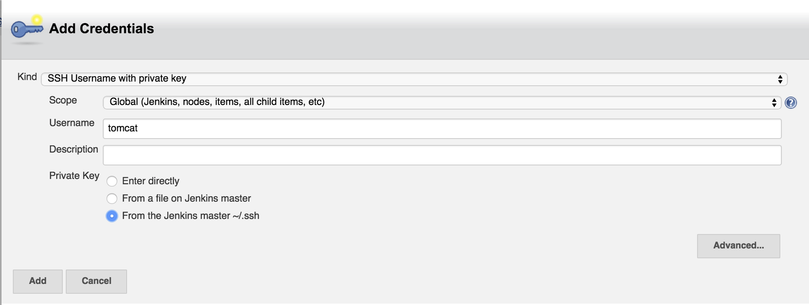

# Setup Jenkins CI with your Node.js LoopBack API and Bitbucket

This tutorial will cover setting up your Nodes.js LoopBack API application with a private Bitbucket repository and Jenkins CI for your continuous integration needs. This is a relatively straightforward process, but there are a few points to which you need to pay attention. Let's jump right in.

## Prerequisites

- You have Node.js installed

- You have git installed

- You have a Bitbucket account

## LoopBack

> _LoopBack is a highly-extensible, open-source Node.js framework_

[LoopBack](http://loopback.io/) allows you to do many things like:

- Quickly create dynamic end-to-end REST APIs.

- Connect devices and browsers to data and services.

- Use Android, iOS, and AngularJS SDKs to easily create client apps.

- Add-on components for push, file management, 3rd-party login, and geolocation.

- Use StrongLoop Arc to visually edit, deploy, and monitor LoopBack apps.

- LoopBack API gateway acts an intermediary between API consumers (clients) and API providers to externalize, secure, and manage APIs.

- Runs on-premises or in the cloud

### Setup LoopBack

Since this post is more about integrating LoopBack and Jenkins, we're just going to use the [LoopBack example application](https://github.com/strongloop/loopback-example-app). Let's get this up and running in a few quick lines.

```bash
$ git clone https://github.com/strongloop/loopback-example-app.git
$ cd loopback-example-app
$ npm install
$ node server/server.js
```

Navigate to [http://localhost:3000/explorer](http://localhost:3000/explorer). You just created a full-fledged API with documentation and an API explorer in seconds!


There's much more to LoopBack than this, of course, but this will do for the purpose of the tutorial. In the meantime, check out their [documentation](http://docs.strongloop.com/display/SL/Installing+StrongLoop) for more information on all the amazing things you can do with LoopBack.

### Make a test

Let's make 1 nonsense test for the purposes of our example. We'll be using the very popular [Mocha](http://mochajs.org/) testing framework. First we need to install the mocha package.

```bash
$ cd /path/to/loopback-example
$ npm install mocha --save-dev
$ mkdir test
$ $EDITOR test/test.js
```

Then we add our test.

```javascript
var assert = require("assert");
describe("Array", function () {
  describe("#indexOf()", function () {
    it("should return -1 when the value is not present", function () {
      assert.equal(-1, [1, 2, 3].indexOf(5));
      assert.equal(-1, [1, 2, 3].indexOf(0));
    });
  });
});
```

Lastly, we make a slight change to the package.json scripts command to run out test. We don't need jshint for right now and we installed mocha locally to our app.

```json
"scripts": { "test": "./node_modules/mocha/bin/mocha" }
```

Let's run our test.

```bash
$ cd /path/to/loopback-example
$ npm test
```


Excellent, we have an API and a passing test! Let's push this to our private Bitbucket repository, then we'll get it working with Jenkins CI.

Create your Bitbucket repository and then push the first commit.

```bash
$ cd /path/to/loopback-example
$ git add .
$ git commit -m "Initial commit"
$ git remote add bitbucket git@bitbucket.org:myusername/loopback-example.git
$ git push -u bitbucket --all
```

Alright, we are ready to move on to Jenkins.

## Jenkins CI

> _Jenkins is an award-winning application that monitors executions of repeated jobs, such as building a software project or jobs run by cron._

### Setup Jenkins CI

We're going to make setting up Jenkins CI version 1.602 easy and use the [Bitnami](https://bitnami.com/) application. If you haven't used Bitnami before, they describe themselves as a _library of popular server applications and development environments that can be installed with one click._ What that means for us is that we don't have to go through the potential pain of installing an application like Jenkins ourselves. We can just download the already preconfigured VM and launch it in Virtualbox.

[Download](https://bitnami.com/stack/jenkins/virtual-machine) the Jenkins CI VM from Bitnami.

[Open up](https://wiki.bitnami.com/Virtual_Appliances_Quick_Start_Guide#Virtual_Box) the VM in Virtualbox.

When you launch the application for the first time, you'll be given the default username and password as well as the IP address at which you can access Jenkins CI.


Head to that IP address/jenkins to see your app: [http://10.0.10.118/jenkins](http://10.0.10.118/jenkins)

### Create a Jenkins CI job

Let's create our Jenkins CI job for our LoopBack application.

Login and then select _New Item_ from the menu.


Choose _Freestyle Project_, enter the name of the project and click ok.


### Integrate Jenkins and Bitbucket

Now we need to setup Jenkins so that it can access our private Bitbucket repository.

**Tricky part #1**

> _The Jenkins application in Bitnami runs as the tomcat user._

Despite the fact that this is laid out pretty clearly in the Bitnami documentation, don't get tripped up by the fact that in Bitnami the Jenkins application runs as the tomcat user.

Take a minute to setup the tomcat user with an ssh key as described in the [Bitnami documentation](https://wiki.bitnami.com/Applications/BitNami_Jenkins#How_to_start_with_Git_and_Jenkins.3f) for Jenkins.

Now that you have an ssh key for the tomcat user, [add that key to Bitbucket](https://confluence.atlassian.com/display/BITBUCKET/Add+an+SSH+key+to+an+account) so that Jenkins can access the repository.

Alright, now that we setup Bitbucket properly and have our tomcat user ssh key ready, back to Jenkins to configure our job.

Select _Git_ from the Source Code Management section and click Add next to Credentials.


Tell Jenkins to use the ssh key you created for the tomcat user above by selecting _SSH Username with private key_ as the kind of credential, entering _tomcat_ as the username and selecting _From the Jenkins master ~/.ssh_ as the Private Key



Click add, select your credentials from the Credentials dropdown on the main configuration screen and enter git@bitbucket.org:myusername/loopback-example.git for the Repository URL.

### Build the project

Now that we're all set with Bitbucket, let's tell Jenkins what to do with our project.

In the Build Triggers section, select _Poll SCM_ and add _/1 _ \* \* \*. Jenkins will ask you if you're sure you want to check the repository every minute. Adjust as you see fit.


Now we need to actually need to tell Jenkins what to do with our repository when it gets a hold of it. Select _Execute shell_ from the Add Build Step dropdown in the Build section.

Tell Jenkins to install the necessary packages and run our test.


> Note*: Don't forget to install Node.js on the Jenkins server!*

**Tricky part #2**

> _/usr/local/bin needs to be in Jenkins path or it won't be able to find npm._

You can set Jenkins environment variables directly in the application.

Go to Manage Jenkins->Configure System and add to the Global Properties->Environment Variables section.


Now, you can either click _Build Now_ in the project menu or wait one minute to have Jenkins poll your repository and build your application.

Soon enough, you'll see some beautiful output in the Console Log window!


## Conclusion

There are a number of steps to get Jenkins setup to work with your private Bitbucket repository and a LoopBack application, but if you know about the tricky parts — which now you do — it shouldn't take you too long.

After you do have it setup, however, Jenkins will build your app every time you push to Bitbucket!
